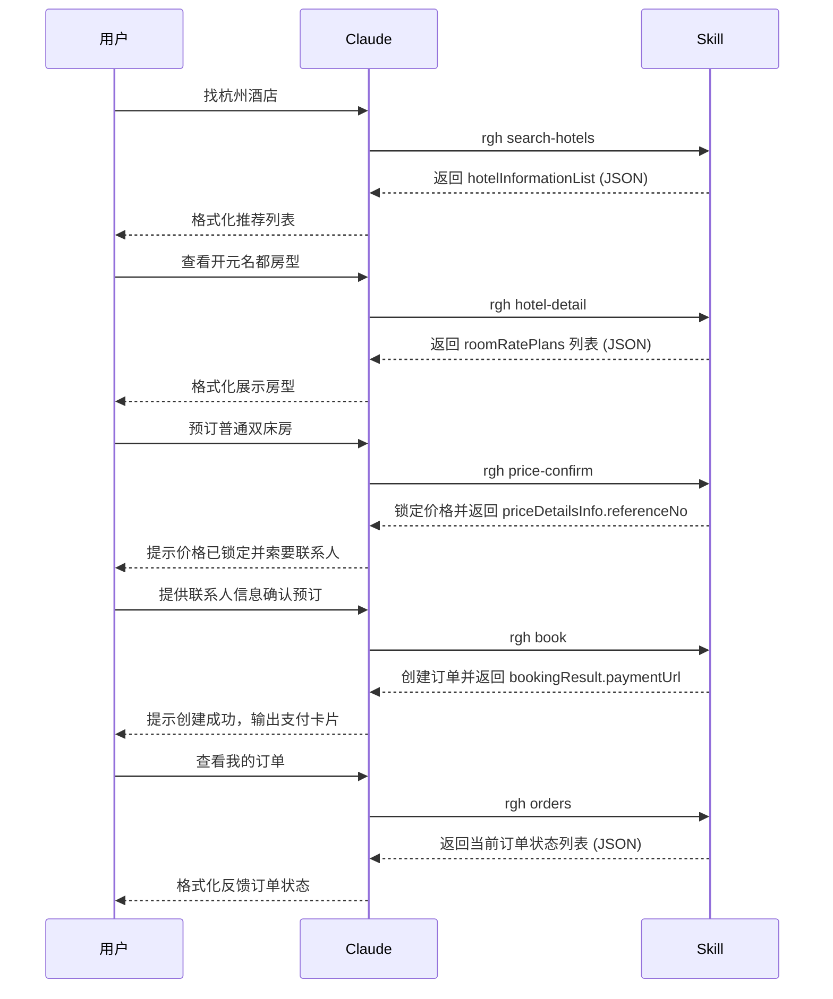

# RollingGo Hotel Skill全球酒店搜索预订Skill-2.0新版本

[English](#english) | [简体中文](#简体中文)

```text
  ██████╗  ██████╗ ██╗     ██╗     ██╗███╗   ██╗ ██████╗  ██████╗  ██████╗ 
  ██╔══██╗██╔═══██╗██║     ██║     ██║████╗  ██║██╔════╝ ██╔════╝ ██╔═══██╗
  ██████╔╝██║   ██║██║     ██║     ██║██╔██╗ ██║██║  ███╗██║  ███╗██║   ██║
  ██╔══██╗██║   ██║██║     ██║     ██║██║╚██╗██║██║   ██║██║   ██║██║   ██║
  ██║  ██║╚██████╔╝███████╗███████╗██║██║ ╚████║╚██████╔╝╚██████╔╝╚██████╔╝
  ╚═╝  ╚═╝ ╚═════╝ ╚══════╝╚══════╝╚═╝╚═╝  ╚═══╝ ╚═════╝  ╚═════╝  ╚═════╝ 
            ██╗  ██╗ ██████╗ ████████╗███████╗██╗     
            ██║  ██║██╔═══██╗╚══██╔══╝██╔════╝██║     
            ███████║██║   ██║   ██║   █████╗  ██║     
            ██╔══██║██║   ██║   ██║   ██╔══╝  ██║     
            ██║  ██║╚██████╔╝   ██║   ███████╗███████╗
            ╚═╝  ╚═╝ ╚═════╝    ╚═╝   ╚══════╝╚══════╝
            
  ──●────●────●────●────●────●──
   AI Skills for Claude • Cursor • Copilot
```

Search → Recommend → Price Confirm → Book → Orders Check


---

只需对 Agent 说一句「我要去 XX 玩，帮我订酒店」

RollingGo酒店预订Skill就能帮你全程搞定：

🔍 按需求**智能筛选**，省心帮你挑酒店

📋 实时查**房型、报价和退改规则**，明明白白不踩坑

🛏️ 心仪房型提前**锁定**，不用愁晚订没房

🔐 无需切换其他平台，Agent内一键安全**登录**，隐私信息有保障

💳 说句“帮我下单”就跳转支付页面**直接付**

📑 订单状态随时能查，全程都省心

💴 还能设置24 小时自动**盯价**，降价马上**提醒**

全球酒店**实时推荐**及**闭环预订**，不用自己蹲点比价，不用纠结早订亏、晚订无，订酒店的烦心事，一句话帮你全打理妥当。


## ✨ Skill亮点

- ✅ **原生智能交互** - Agent-Native原生交互设计，自然对话即可完成预订全流程
- ✅ **实时库存价确** - 库存直连+实时价格确认能力，信息零延迟，查询结果均可直接预订
- ✅ **成熟供应链保障** - 全球第三大酒旅B2B官方数据源，14年旅行产品供应链积累，全链路API直连
- ✅ **海量酒店覆盖** - 坐拥200万+酒店资源，覆盖全球主要目的地
- ✅ **直签酒店资源** - 11万+直签酒店直连，价格库存实时响应，确保查询结果准确可订
- ✅ **多元供应体系** - 整合500+全球供应商，涵盖各类酒店品牌，满足不同用户预订需求
- ✅ **差异化价格优势** - 锚定OTA上游供应，海外酒店及上海、香港、日韩等热门目的地价格优势显著
- ✅ **兼容性** - 支持 Cursor、Claude Code、Codex、Windsurf、Copilot 等 40 多种主流大模型代理


## ✨ 安装方式
### 方式一：直接跟你的agent说 (推荐)
```
帮我安装这个skill: https://github.com/RollingGo-AI/rollinggo-hotel-skill-CN
```
想省事、纯可视化操作，选择这种安装方式。
### 方式二：通过 npx skills 安装 (推荐)
自动兼容 Cursor, Claude Code, Windsurf 等 40+ 种代理，开发运维、需精准控制模块、多工具切换用此类安装方式。

```bash
# 交互式安装 (推荐，可从菜单中自由勾选不同能力模块)
npx skills add https://github.com/RollingGo-AI/rollinggo-hotel-skill-CN

# 或直接定向安装特定核心模块 (跳过交互选单)
npx skills add https://github.com/RollingGo-AI/rollinggo-hotel-skill-CN --skill hotel-core
```

CLI 会自动检测您系统上安装的 Agent。您也可以通过 `--agent` 强制指定目标环境：

```bash
npx skills add https://github.com/RollingGo-AI/rollinggo-hotel-skill-CN --agent cursor
```

### 方式三：手动克隆/复制

克隆本仓库，将 `skills/hotel-core/` 文件夹直接放入您 Agent 对应的技能目录即可：

| 代理工具 | 本地技能存放目录 |
|-------|-----------------|
| Claude Code | `~/.claude/skills/` |
| Cursor | `~/.cursor/skills/` |
| OpenAI Codex | `~/.codex/skills/` |
| Windsurf | `~/.windsurf/skills/` |
| Google Antigravity | `~/.gemini/antigravity/skills/` |

### 核心能力清单
| 指令 | 业务描述 |
|-------|-------------|
| **`rgh login`** | OAuth 2.1 PKCE 免密安全授权 |
| **`rgh search-hotels`** | 支持按地标、日期、标签多维度检索酒店 |
| **`rgh hotel-detail`** | 实时拉取酒店房型、最新报价与退改政策 |
| **`rgh price-confirm`** | 锁定房间价格并生成交易参考号 `referenceNo` |
| **`rgh book`** | 提交预订入住人信息，返回真实的付款链接 |
| **`rgh orders`** | 查阅历史订单及最新支付状态 |

### 大模型操作 SOP (标准作业程序)
要求 AI 建议或自动执行的规范代码流：

```bash
# 1. 首先检查用户登录状态
rgh whoami
# -> 如果未登录，引导用户先执行 `rgh login`

# 2. 检索意向酒店（例如：下周的上海酒店）
rgh search-hotels --place "Shanghai" --check-in-date 2026-06-20

# 3. 将搜索结果用 Markdown 呈现给用户。待用户挑选后，获取详情：
rgh hotel-detail --hotel-id 12345 --check-in-date 2026-06-20

# 4. 用户确定房型后，进行锁价预订 (此步为高风险，必须要求用户确认！)
rgh price-confirm --hotel-id 12345 --rate-plan-id "RP01" --rooms 1 --check-in-date 2026-06-20 --check-out-date 2026-06-21 --adults 2

# 5. 在用户同意上述锁定的价格并提供姓名邮箱后，正式下单：
rgh book --reference-no "REF9999" --first-name "San" --last-name "Zhang" --email "zhangsan@example.com"
```


---
## ✨ 效果演示

以下展示通过 Claude Code、Cursor 等 AI 代理运行本 Skill 的完整对话和终端命令执行流程。你无需了解任何命令行参数，AI 代理会自动识别你的自然语言意图并调用 `rgh` CLI 命令行工具。

### 2.1 说需求

```
用户：我下周六（6月20日）要去杭州出差，帮我在杭州找个 5 星级的开元酒店，2 人住 1 晚
```

AI 代理在后台执行酒店搜索：

```bash
$ rgh search-hotels --origin-query "杭州5星级开元酒店，2人入住1晚" --place "杭州" --place-type "城市" --check-in-date 2026-06-20 --stay-nights 1 --star-ratings 5 --size 3
```

命令行输出：
```json
{
  "success": true,
  "hotelInformationList": [
    {
      "hotelId": 1090005,
      "bookingUrl": "https://rollinggo.cn/xxxx",
      "name": "杭州富阳东方茂开元名都大酒店",
      "brand": "德胧",
      "address": "富春街道金桥北路61号",
      "destinationId": "6084457",
      "latitude": 30.049471,
      "longitude": 119.933616,
      "starRating": 5,
      "price": {
        "message": "查价成功。最低价格：352，币种：CNY",
        "hasPrice": true,
        "currency": "CNY",
        "lowestPrice": 352
      },
      "areaCode": "CN",
      "description": "<p><b>酒店简介描述</b><br/>杭州富阳东方茂开元名都大酒店地处富阳区CBD...</p>",
      "imageUrl": "https://image2-cdn.aigohotel.com/3/Image/1090005/0221d1200084a0cdf79B1_R_550_412.jpg-agh",
      "hotelAmenities": ["健身室", "室内恒温泳池", "大堂吧", "WIFI"],
      "tags": ["五星酒店", "健身房", "免费WiFi", "免费停车场"],
      "nameEn": "Grand New Century Hotel Fuyang"
    }
  ]
}
```

AI 代理将数据格式化，回复给用户：

```
AI 助手: 找到以下符合要求的杭州五星级开元酒店：

🏨 杭州富阳东方茂开元名都大酒店
⭐ 5.0星  📍 位于富阳区CBD，地铁口旁
💰 参考价 ¥352/晚
🏷️ 五星酒店 · 健身房 · 免费WiFi · 免费停车场
🔗 [查看详情 & 预订](https://rollinggo.cn/xxxx)

你想了解该酒店的详细房型和报价吗？
```

---

### 2.2 选酒店、看房型

```
用户：好的，帮我看看这家酒店有什么房型
```

AI 代理自动调用接口获取该酒店的实时房型及价格列表：

```bash
$ rgh hotel-detail --hotel-id 1090005 --check-in-date 2026-06-20 --check-out-date 2026-06-21 --room-count 1 --adult-count 2
```

命令行输出：
```json
{
  "success": true,
  "hotelId": 1090005,
  "bookingUrl": "https://rollinggo.cn/xxxx",
  "name": "杭州富阳东方茂开元名都大酒店",
  "checkIn": "2026-06-20",
  "checkOut": "2026-06-21",
  "roomRatePlans": [
    {
      "roomTypeId": 22724870,
      "roomName": "普通双床房",
      "roomNameCn": "普通双床房",
      "ratePlanId": "6sQgUxvnJoG-bzLZRIVAeUw",
      "ratePlanName": "普通双床房",
      "bedType": 5,
      "bedTypeDescription": "2 单人床",
      "currency": "CNY",
      "totalPrice": 352,
      "isOnRequest": false,
      "cancellationPolicies": [
        {
          "fromDate": "2026-06-19T00:00:00+08:00",
          "amount": 352
        }
      ]
    }
  ],
  "message": "搜索成功",
  "nameEn": "Grand New Century Hotel Fuyang"
}
```

AI 代理格式化呈现给用户：

```
AI 助手: 杭州富阳东方茂开元名都大酒店房型明细如下：

🛏️ 普通双床房（2 单人床）
💰 总价 ¥352（¥352/晚）  剩余充足
📋 取消政策：2026年6月19日前取消收取全额房费罚金（不可免费取消）

如需预订此房型，请告诉我。
```

---

### 2.3 确认房型、锁价

```
用户：那就订普通双床房吧
```

AI 代理在后台调用 `price-confirm` 命令锁价，确认实时报价并获取交易参考号：

```bash
$ rgh price-confirm --hotel-id 1090005 --rate-plan-id "6sQgUxvnJoG-bzLZRIVAeUw" --rooms 1 --check-in-date 2026-06-20 --check-out-date 2026-06-21 --adults 2
```

命令行输出：
```json
{
  "success": true,
  "message": "Price confirm success",
  "priceDetailsInfo": {
    "referenceNo": "17815407901",
    "checkInDate": "2026-06-20 00:00:00",
    "checkOutDate": "2026-06-21 00:00:00",
    "hotelList": [
      {
        "hotelName": "杭州富阳东方茂开元名都大酒店(Grand New Century Hotel Fuyang)",
        "totalPrice": 352,
        "referenceTotalPrice": 402,
        "ratePlanList": [
          {
            "roomName": "普通双床房",
            "bedType": 52,
            "currency": "CNY",
            "totalPrice": 352,
            "averagePrice": 352,
            "isOnRequest": false
          }
        ],
        "cancellationPolicyList": [
          {
            "fromDate": "2026-06-19T00:00:00+08:00",
            "amount": 352
          }
        ]
      }
    ]
  }
}
```

AI 代理向用户进行二次确认（安全门控机制）：

```
AI 助手: ✅ 价格与房态已锁定！

酒店：杭州富阳东方茂开元名都大酒店
房型：普通双床房
日期：2026-06-20 → 2026-06-21（1 晚）
总价：¥352（含税费）
取消政策：2026年6月19日前可取消，超期收取 ¥352 罚金
⏰ 锁定有效期：30分钟

确认预订吗？如果确认，请提供入住人的中文姓名拼音（或英文名）以及接收确认邮件的邮箱。
```

> [!WARNING] 锁定有效期
> 价格锁定有效期约 30 分钟。若用户犹豫时间过长，下单前 AI 代理会再次触发价格锁定以防失效。

---

### 2.4 确认下单、获取支付链接

```
用户：确认，入住人张三（ZHANG SAN），邮箱 zhangsan@example.com
```

AI 代理调用 `book` 命令生成最终订单并获取支付链接：

```bash
$ rgh book --reference-no "17815407901" --first-name "SAN" --last-name "ZHANG" --email "zhangsan@example.com"
```

命令行输出：
```json
{
  "success": true,
  "bookingResult": {
    "orderNo": "H178168930177922821",
    "paymentType": "URL",
    "paymentUrl": "https://rollinggo.cn/xxxx"
  }
}
```

AI 代理提供支付卡片：

```
AI 助手: 🎉 预订成功，订单已创建！

确认号：**H178168930177922821**
酒店：杭州富阳东方茂开元名都大酒店
房型：普通双床房
入住：2026-06-20 | 离店：2026-06-21
总价：¥352

💳 请在30分钟内点击以下链接完成支付：
[点击前往完成支付](https://rollinggo.cn/xxxx)

支付完成后，您可以随时对我说“查看我的订单”进行状态核对。
```

---

### 2.5 查订单

```
用户：我的订单
```

AI 代理查询该账户的所有订单列表：

```bash
$ rgh orders
```

命令行输出：
```json
[
  {
    "hotelBookingInfo": {
      "referenceNo": "17815407901",
      "status": "3",
      "checkInDate": "2026-06-20T00:00:00.000",
      "checkOutDate": "2026-06-21T00:00:00.000",
      "numOfRooms": 1,
      "nights": 1,
      "totalPrice": 352,
      "mainOrderNo": "M17816893017792282",
      "subOrderNo": "H178168930177922821",
      "language": "zh_CN",
      "channel": "AI_LAB",
      "partner": "rollinggo",
      "priceConfirmTime": "2026-06-17T17:41:28.000"
    },
    "hotelBookingHotel": {
      "hotelId": 1090005,
      "hotelName": "Grand New Century Hotel Fuyang",
      "hotelAddress": "富春街道金桥北路61号",
      "hotelPhone": "0571-63287888",
      "starRating": "5.0",
      "image": "https://image2-cdn.aigohotel.com/...",
      "timezone": "Asia/Shanghai",
      "checkInFrom": "15:00:00",
      "checkOutTo": "12:00:00",
      "cityCode": "6084457"
    },
    "hotelContact": {
      "firstName": "SAN",
      "lastName": "ZHANG",
      "phone": "+86-19189734356",
      "email": "zhangsan@example.com"
    },
    "hotelGuestList": [
      {
        "roomNum": 1,
        "firstName": "SAN",
        "lastName": "ZHANG",
        "isAdult": true
      }
    ],
    "hotelRatePlanInfo": {
      "hotelId": 1090005,
      "roomNum": 1,
      "adultCount": 2,
      "childCount": 0,
      "roomTypeId": 22724870,
      "roomName": "普通双床房",
      "roomNameCn": "普通双床房",
      "ratePlanId": "6sQgUxvnJoG-bzLZRIVAeUw",
      "ratePlanName": "普通双床房",
      "bedType": 5,
      "currency": "CNY",
      "totalPrice": 352,
      "averagePrice": 352,
      "isOnRequest": false,
      "hasWifi": true
    },
    "hotelDailyPriceList": [
      {
        "price": 352,
        "stayDate": "2026-06-20T00:00:00.000",
        "mealType": 1,
        "mealAmount": 0
      }
    ],
    "hotelCancellationPolicyList": [
      {
        "fromDate": "2026-06-19T00:00:00.000",
        "fromDateLocal": "2026-06-19T00:00:00.000",
        "amount": 352
      }
    ],
    "currentTimeBeijing": "2026-06-17T17:41:48.146"
  }
]
```

AI 代理回复：

```
AI 助手: 您当前有 1 笔进行中的酒店订单：

🏨 Grand New Century Hotel Fuyang (杭州富阳东方茂开元名都大酒店)
🛏️ 普通双床房 · 1间房 · 1晚
📅 入住日期：2026-06-20 至 2026-06-21
👤 入住人：ZHANG SAN
💰 总价：¥352
状态：已创建/待支付（Status: 3）

如果需要支付，可以点击此前的支付链接；若要了解退改详情，请告诉我。
```

---

### 2.6 完整对话链路



---

### 风险等级
**中等风险 (MODERATE)** — 此技能可触发真实的现实世界酒店客房交易。已通过严格的两步确认机制拦截未经授权的 `book` 调用。
为 **RollingGo 酒店命令行工具** (`@rollinggo/hotel`) 量身定制的官方 AI 技能库。它能够教会各类 AI 代理正确的酒店预订流程、OAuth 2.1 PKCE 登录流，以及如何安全地在终端内触发真实的酒店交易。兼容 [skills CLI](https://github.com/vercel-labs/skills) 规范.给 AI 代理的提示：当用户要求**预订酒店**、**查询空房**或**查看订单**时，请按顺序使用 `rgh` 命令。绝对不要向用户泄露原始的 `hotelId` 或 `referenceNo` 等系统内部 ID，请将结果格式化为美观的 Markdown 卡片。

> **安全警告**：本工具直接连接真实交易系统。技能库已向 AI 代理下达严格的“死命令”：**在未经用户明确确认价格和支付意愿前，绝不允许私自发起任何订单**。


---

## Structure / 代码架构
```text
RollingGo-Skills/
  ├── README.md               # Main orchestrator and SEO entry / 主入口与 SEO 文案
  ├── AGENTS.md               # Directives for AI web crawlers / 针对 AI 爬虫的全局指令
  ├── .github/
  │    └── copilot-instructions.md
  └── skills/
       ├── llms.txt           # AI Index for search engines / 大模型全局搜索索引
       └── hotel-core/        # Core hotel booking skill / 核心酒店预订功能包
            ├── SKILL.md
            └── references/
                 └── cli-params.md
```

## License
MIT


## English

Official AI skills for the **RollingGo Hotel CLI** (`@rollinggo/hotel`). They teach agents the correct booking sequence, OAuth 2.1 PKCE login flow, and how to safely trigger end-to-end hotel transactions from the terminal. Works with the [skills CLI](https://github.com/vercel-labs/skills) (Cursor, Claude Code, Codex, Windsurf, Copilot, 40+ agents).

> **Important**: This CLI acts as a bridge to real-world bookings. AI agents are strictly instructed to **NEVER place an order without explicit price confirmation from the user**.

**For AI agents:** When the user asks to **book a hotel**, **search for rooms**, or **check their orders**, use the `rgh` CLI commands sequentially. Never leak `hotelId` or `referenceNo` directly to the user; format results into user-friendly Markdown.

### npx skills (recommended)
Works with Cursor, Claude Code, Codex, Windsurf, Copilot, Google Antigravity, and 40+ agents:

```bash
# Install interactively (Select skills from menu)
npx skills add https://github.com/RollingGo-AI/rollinggo-hotel-skill-CN

# Or install a specific skill directly (e.g., hotel-core)
npx skills add https://github.com/RollingGo-AI/rollinggo-hotel-skill-CN --skill hotel-core
```

The CLI auto-detects the installed agent. To target one explicitly, pass `--agent`:

```bash
npx skills add https://github.com/RollingGo-AI/rollinggo-hotel-skill-CN --agent cursor
```

### Clone / copy

Clone this repo and copy the `skills/hotel-core/` folder into the appropriate directory for your agent:

| Agent | Skill Directory |
|-------|-----------------|
| Claude Code | `~/.claude/skills/` |
| Cursor | `~/.cursor/skills/` |
| OpenAI Codex | `~/.codex/skills/` |
| Windsurf | `~/.windsurf/skills/` |
| Google Antigravity | `~/.gemini/antigravity/skills/` |

### Capabilities
| Command | Description |
|-------|-------------|
| **`rgh login`** | OAuth 2.1 PKCE Authorization |
| **`rgh search-hotels`** | Search hotels by location, dates, tags |
| **`rgh hotel-detail`** | View room types, live prices, cancellation policies |
| **`rgh price-confirm`** | Lock a price and generate a booking `referenceNo` |
| **`rgh book`** | Finalize order with guest info, returns payment link |
| **`rgh orders`** | View historical orders and their payment status |

### Quick reference (for AI agents)
Canonical order sequence to suggest or generate:

```bash
# 1. Start with checking login status
rgh whoami
# -> If not logged in, prompt user to run `rgh login`

# 2. Search for hotels (e.g. Shanghai next week)
rgh search-hotels --place "Shanghai" --check-in-date 2026-06-20

# 3. Present options to user and get their choice. Then fetch details:
rgh hotel-detail --hotel-id 12345 --check-in-date 2026-06-20

# 4. Once user picks a room and rate plan, lock the price (Requires user confirmation!)
rgh price-confirm --hotel-id 12345 --rate-plan-id "RP01" --rooms 1 --check-in-date 2026-06-20 --check-out-date 2026-06-21 --adults 2

# 5. After the user approves the locked price and provides their Name/Email:
rgh book --reference-no "REF9999" --first-name "San" --last-name "Zhang" --email "zhangsan@example.com"
```

### Risk level
**MODERATE** — Can trigger real-world hotel reservations. The skill enforces a strict two-step confirmation gate before making any `book` calls.

---

